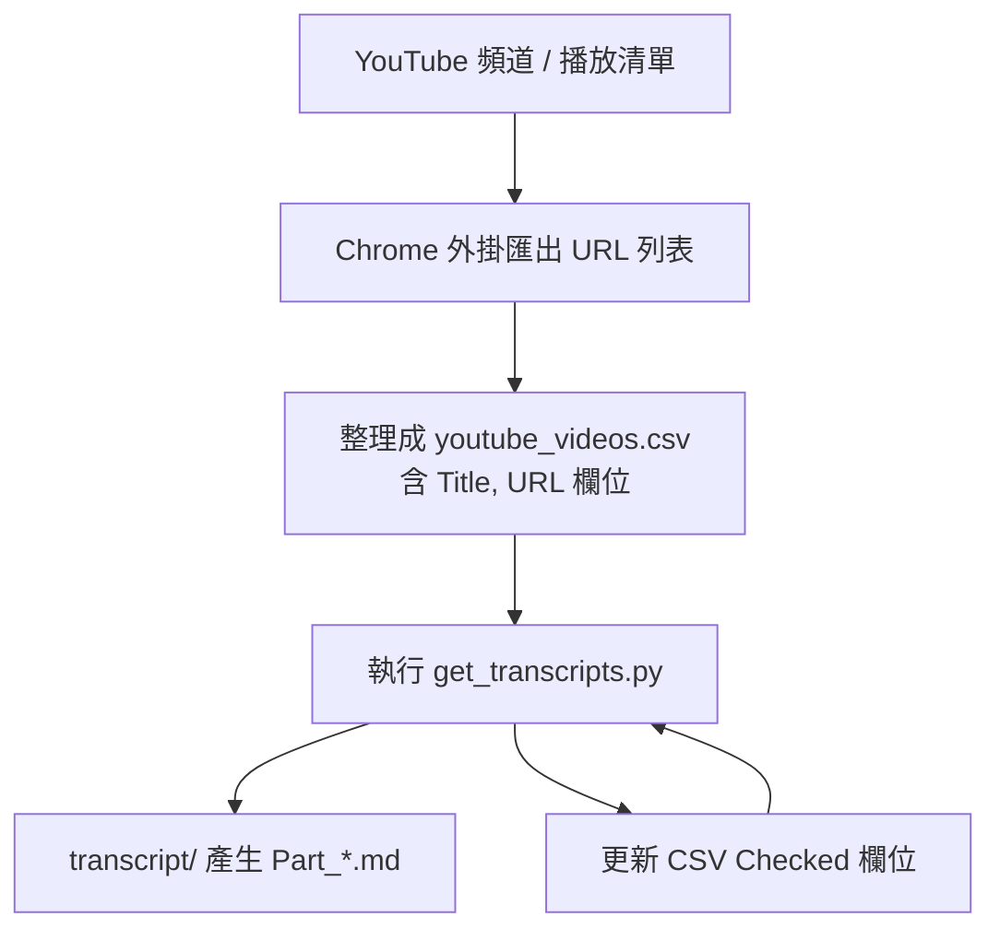

# yt-transcript

使用 Gemini API 從 YouTube URL 產生逐字稿，並把結果按每 10 支影片合併成
一個 Markdown 檔案（可續跑）。

## 快速取得影片列表

可用 Chrome 外掛快速抓 YouTube 影片 URL：
https://chromewebstore.google.com/detail/youtube-url-extractor/jmilibpbdpajjnabchfpfmmmjgbimefo

## 流程圖



## 需求

- Python 3
- 可連網
- Gemini API Key
- 僅支援公開影片（private / unlisted 不可用）

## 環境建置（虛擬環境）

```bash
cd /Users/jw-mba/Projects/Active/yt-transcript
python3 -m venv .venv
source .venv/bin/activate
python3 -m pip install pandas requests
```

## API Key

在 Google AI Studio 建立 key，並設定環境變數：

```bash
export GEMINI_API_KEY="YOUR_KEY"
```

可選：把 key 放在本機檔案（不要提交），用 `GEMINI_KEY_PROFILE` 來切換：

```bash
printf '%s' 'PAID_KEY' > .gemini_key_paid
printf '%s' 'FREE_KEY' > .gemini_key_free
chmod 600 .gemini_key_paid .gemini_key_free

# 切換要用哪一把 key
export GEMINI_KEY_PROFILE=paid   # 或 free
```

未指定 `GEMINI_KEY_PROFILE` 時，會依序嘗試 `.gemini_key_paid`、
`.gemini_key`、`.gemini_key_free`。

## 執行

```bash
python3 get_transcripts.py
```

只處理接下來 10 支未完成的影片：

```bash
MAX_VIDEOS=10 python3 get_transcripts.py
```

若不想啟用虛擬環境，可直接用專案內的 Python（適合無狀態 CLI）：

```bash
./.venv/bin/python get_transcripts.py
```

只處理接下來 10 支未完成的影片：

```bash
MAX_VIDEOS=10 ./.venv/bin/python get_transcripts.py
```

## CSV 輸入

腳本讀取 `youtube_videos.csv`，至少需要：

- `Title`
- `URL`

第一次執行會新增 `Checked` 欄位，並把已完成的列標記為 `[x]`，之後會自動
略過已勾選的列。

## 輸出

輸出檔會寫入 `transcript/`，例如：

```
transcript/易學基地頻道_影片逐字稿_Part_1.md
```

腳本每處理完一支就寫檔，可隨時中斷再續跑。

## 續跑機制

- 每 10 支影片為一個 Part 檔案
- 既有 Part 檔若已完整，會直接跳過
- 中斷後重跑會從下一支未完成影片開始

## 設定（環境變數）

- `GEMINI_API_KEY`（必填）
- `GEMINI_KEY_PROFILE`（可選：`paid` / `free`，指定使用哪一把 key）
- `GEMINI_MODEL`（預設：`gemini-2.5-flash-lite`）
- `GEMINI_MAX_OUTPUT_TOKENS`（預設：`8192`）
- `GEMINI_MAX_CONTINUATIONS`（預設：`3`）
- `GEMINI_TIMEOUT`（預設：`120` 秒）
- `GEMINI_MAX_RETRIES`（預設：`5`）
- `RETRY_FOREVER_ON_TIMEOUT`（預設：`1`，超時就一直重試）
- `GEMINI_SLEEP`（預設：`0.6` 秒）
- `PROMPT_FILE`（預設：`prompt.txt`）
- `OVERWRITE`（設 `1` 強制覆寫既有 Part 檔）
- `MAX_VIDEOS`（本次只跑 N 支未完成影片）
- `CHECK_COLUMN`（預設：`Checked`）
- `MERGE_LINES`（預設：`1`，合併短行讓格式更好看）
- `LOG_DIR`（預設：`logs`）
- `LOG_FILE`（預設：`run_log.csv`）
- `INPUT_PRICE_PER_M`（每 1M token 輸入成本，預設：0.10）
- `OUTPUT_PRICE_PER_M`（每 1M token 輸出成本，預設：0.40）
- `GEMINI_MEDIA_RESOLUTION`（可選：`LOW` / `MEDIUM` / `HIGH`，預設空白）

## 開關指令速查（說人話）

以下都是「把開關接在指令前面」的寫法：

```bash
# 只跑接下來 10 支
MAX_VIDEOS=10 ./.venv/bin/python get_transcripts.py

# 強制覆寫已存在的 Part 檔
OVERWRITE=1 ./.venv/bin/python get_transcripts.py
# 例子：已跑過 1–8 支（Part_1 已存在），下次從第 9 支續跑
# - 不加 OVERWRITE：會接著寫在 Part_1 後面
# - 加 OVERWRITE=1：會把 Part_1 整個重寫（1–8 也會被覆蓋）

# 指定模型（預設已是 2.5-flash-lite，可自行改）
GEMINI_MODEL="gemini-2.5-flash" ./.venv/bin/python get_transcripts.py

# 降解析度（更省成本）
GEMINI_MEDIA_RESOLUTION=LOW ./.venv/bin/python get_transcripts.py

# 切換 key（付費 / 免費）
GEMINI_KEY_PROFILE=paid ./.venv/bin/python get_transcripts.py
GEMINI_KEY_PROFILE=free ./.venv/bin/python get_transcripts.py

# 合併短行（讓格式更像 2.5-flash）
MERGE_LINES=1 ./.venv/bin/python get_transcripts.py
MERGE_LINES=0 ./.venv/bin/python get_transcripts.py

# 超時秒數
GEMINI_TIMEOUT=180 ./.venv/bin/python get_transcripts.py

# 每次呼叫之間的等待時間（秒）
GEMINI_SLEEP=1.2 ./.venv/bin/python get_transcripts.py

# 最多重試幾次（非超時）
GEMINI_MAX_RETRIES=3 ./.venv/bin/python get_transcripts.py

# 超時是否無限重試（1=是, 0=否）
RETRY_FOREVER_ON_TIMEOUT=0 ./.venv/bin/python get_transcripts.py

# 輸出 token 上限（太小可能會分段續寫）
GEMINI_MAX_OUTPUT_TOKENS=4096 ./.venv/bin/python get_transcripts.py

# 最多允許續寫幾段
GEMINI_MAX_CONTINUATIONS=2 ./.venv/bin/python get_transcripts.py

# log 位置
LOG_DIR=logs LOG_FILE=run_log.csv ./.venv/bin/python get_transcripts.py

# CSV 勾選欄位名稱（通常不用改）
CHECK_COLUMN=Checked ./.venv/bin/python get_transcripts.py

# 成本單價（依你的付費方案調整）
INPUT_PRICE_PER_M=0.30 OUTPUT_PRICE_PER_M=2.50 ./.venv/bin/python get_transcripts.py
```

## 注意事項

- YouTube URL 功能是 preview，規則與限制可能變動，長跑請留意狀態。
- `.venv` 不建議搬移，換目錄或換電腦請重建環境。
- API Key 請妥善保管，若外洩請撤銷重建。
- 每次執行會追加寫入 `logs/run_log.csv`，可用來核對每支影片的 token 與成本。
- 若要省成本，建議設定 `GEMINI_MEDIA_RESOLUTION=LOW`，通常可顯著降低影片輸入 token。
- 未設定 `GEMINI_MEDIA_RESOLUTION` 時會走 API 預設 `MEDIA_RESOLUTION_UNSPECIFIED`（不是高/低）。
- 若使用免費 key 遇到請求上限，腳本會中斷並顯示原因，同時寫入 log。

## 最近新增功能（摘要）

- 每支影片會記錄 input/output token 與預估成本，工作完成後會輸出本次總計。
- 新增 `logs/run_log.csv`，紀錄工作階段與每支影片的 token、成本與耗時。
- CSV 會自動新增「序號」欄位（位於 URL 前），方便核對進度。
- 新增 `GEMINI_MEDIA_RESOLUTION`，可用 `LOW` 降低影片輸入 token。
- 支援 `GEMINI_KEY_PROFILE` 切換付費/免費 key，免費上限會直接中斷並寫入 log。
- key 檔名改為 `.gemini_key_paid` / `.gemini_key_free`（可用 `GEMINI_KEY_PROFILE` 指定）。
- 新增 `MERGE_LINES`（預設開），自動合併短行改善格式。

## 成本估算（粗估）

官方說明：影片約 **300 tokens/秒（預設解析度）**，低解析度更少。
逐字稿輸出 tokens 相對少很多。

以 `gemini-2.5-flash-lite`（付費）為例：

- 輸入：`$0.10 / 1M tokens`
- 輸出：`$0.40 / 1M tokens`

範例（預設解析度）：

- 6 分鐘（360s）≈ 108k tokens → 約 **$0.01**
- 7 分鐘（420s）≈ 126k tokens → 約 **$0.01**
- 20 分鐘（1200s）≈ 360k tokens → 約 **$0.04**

輸出通常是幾千 tokens，通常 **< $0.01 / 支**。

## 常見問題

- **看起來卡住**：每支影片都是一次 API 呼叫，耗時正常。腳本每支都會寫檔，
  到 `transcript/` 檢查是否有新內容即可。
- **`[無法獲取逐字稿]`**：API 呼叫失敗，重跑會自動重試。可先用
  `MAX_VIDEOS=1` 測試單支。
- **`[錯誤：無效的 YouTube 連結]`**：CSV 內 URL 欄位空白或格式不正確。
- **HTTP/429**：請調大 `GEMINI_SLEEP` 或降低 `MAX_VIDEOS`。
